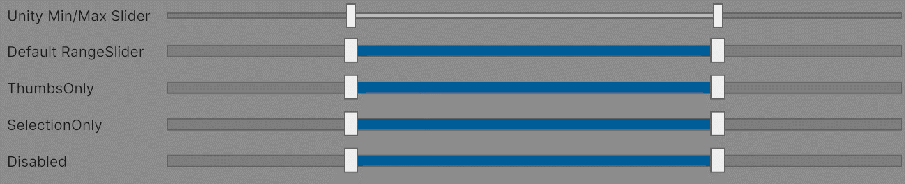

# RangeSlider

An alternative to the built-in [MinMaxSlider](https://docs.unity.cn/ScriptReference/UIElements.MinMaxSlider.html), built to support more intuitive interaction and customization.



## Public API

The API and structure for RangeSlider is very similar to [MinMaxSlider](https://docs.unity.cn/ScriptReference/UIElements.MinMaxSlider.html) and is intended to be as close to a drop-in replacement as possible. 

### UXML Properties

|                    |                                                                                                |                                                                         |
|--------------------|------------------------------------------------------------------------------------------------|-------------------------------------------------------------------------|
| `min-value`        | Sets the initial `MinValue` (low end of the selection)                                         | `float`                                                                 |
| `max-value`        | Sets the initial `MaxValue` (high end of the selection)                                        | `float`                                                                 |
| `low-limit`        | Sets `LowLimit` (the minimum possible value on the slider)                                     | `float`                                                                 |
| `high-limit`       | Sets `HighLimit` (the maximum possible value on the slider)                                    | `float`                                                                 |
| `interaction-mode` | Sets `Mode`, to determine which parts of the slider are interactive and how they should behave | One of: `Disabled`, `ThumbsOnly`, `SelectionOnly`, `ThumbsAndSelection` |

### Properties

|                   |                                                                                                                           |
|-------------------|---------------------------------------------------------------------------------------------------------------------------|
| `Mode`            | The InteractionMode of the slider. Allows you to set whether the thumbs, selection area, or both accept and handle input. |
| `LowLimit`        | The lowest possible value that can be selected.                                                                           |
| `HighLimit`       | The highest possible value that can be selected.                                                                          |
| `MinValue`        | The lower value of the current selection.                                                                                 |
| `MaxValue`        | The upper value of the current selection.                                                                                 |
| `value`           | The current value of the slider, as a Vector2                                                                             |
| `Range`           | The distance between MinValue and MaxValue.                                                                               |
| `TotalRange`      | The distance between LowLimit and HighLimit.                                                                              |
| `MarkerContainer` | A VisualElement you can use to insert custom markers, icons, etc., into the slider.                                       |
|                   |                                                                                                                           |
|                   |                                                                                                                           |

### Additional Methods

|                                              |                                                                                                         |
|----------------------------------------------|---------------------------------------------------------------------------------------------------------|
| `AddMarker(float value, Color color)`        | Inserts a simple line marker at the given value of the slider                                           |
| `AddMarker(float v0, float v1, Color color)` | Inserts a rectangular marker which spans the values between `v0` and `v1`                               |
| `ClearMarkers()`                             | Clears all markers from the slider (including any you may have added directly to the `MarkerContainer`) |


## Installation Instructions
1. In Unity, open the Package Manager (`Window -> Package Manager`)
2. In the Add Package menu, choose `Add package from git url...`
3. Enter `git@github.com:noirb/UIT_RangeSlider.git` to get the latest version.
    * You can specify an explicit version by appending a tag or commit hash to the end of the URL:
      ```
      git@github.com:noirb/UIT_RangeSlider.git#v1.0.0
      ```
4. After installing the package, add the [RangeSlider stylesheet](../UI/RangeSlider.uss) to your Runtime theme.